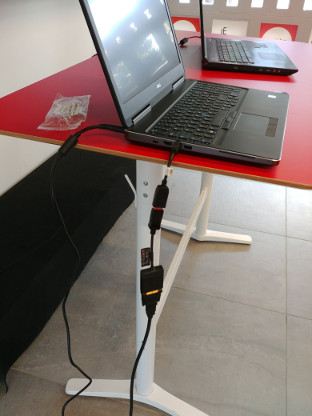

# Devs cO'LAB v2

Le sujet en quelques buzzwords : `#twitter`, `#bigdata`, `#elastic`, `#docker`, `#tweetmap`, `#labo`

Tu as tout compris? non? reprenons en français:
Basé sur l'idée de #onemilliontweetmap : [https://onemilliontweetmap.com/](https://onemilliontweetmap.com/),
l'idée est d'afficher les tweets parlant du LAB'O et de ses startups sur une carte 🗺️. Deux parties:
- Extraction des tweets utilisant le `#lavieaulabo`, mentionnant `@le_lab_o`, issus de `@le_lab_o`, mentionnant des startups du LAB'O ... liste non exhaustive. Un point important pour filtrer : la géolocalisation doit être activée sur le tweet. Stockage dans une base de données elastic ([https://www.elastic.co/fr/](https://www.elastic.co/fr/))
- Récupération depuis la base de données et affichage des points sur une carte

[Code source](https://github.com/lab-o/devs-colab-v2)

## Ateliers
### v2.0 - 2018-04-03

7 participant.e.s

- 11h45 - Burgers commandés, début de l'installation
- 12h00 - Le PC portable initialement prévu n'arrive pas à se connecter via le câble HDMI. L'équipe du #devs cO'LAB est sur le coup.
- 12h18 environ - La décision est prise de changer de PC après 2 redémarrages et une mise à jour du pilote graphique... en vain
- 12h22 - Le nouveau PC est démarré, il faut encore transférer quelques fichiers et installer certains outils comme Atom...
- 12h28 - Début du briefing avec l'équipe. Les choses sérieuses vont enfin pouvoir commencer!
- 12h30 - Premier codeur et "C'est qui qui a pris le burger Classik?"

- 15h00 (peut être un peu dépassé) - On lève les mains du clavier! ça ne fonctionne pas mais tant pis, on a quand même bien avancé! Félicitations 👏 aux codeurs et à la codeuse qui ont pu réaliser les tâches suivantes:

    - Création du projet et "Hello World" en node.js (c'est la base)
    - Empaquetage de l'application dans un container docker
    - Installation de la lib node-twitter
    - Explications du fonctionnement de docker et de docker-compose
    - Récupération des tweets
    - Tentative de lancement d'elastic search (c'est pour l'instant un échec, les deux noeuds d'elastic ne communiquent pas)

### v2.1 - 2018-04-24

#### Les préparatifs

Le PC de secours de la dernière fois étant un PC fixe, ce n'était pas pratique à transporter. Il fallait donc trouver une solution pour faire fonctionner le PC portable dont le HDMI ne voulait pas se connecter à l'écran.

Après une bonne demi-journée passée par l'équipe de DEV3I à essayer de diagnostiquer le problème, de la mise à jour de pilotes en passant par le démarrage sur une clé bootable linux (un message nous indiquait que l'EDID est invalide, bizarre...), nous avons dû nous rendre à l'évidence, il fallait trouver une autre solution.

Alors voilà:

Par une suite de quelques adaptateurs, nous arrivons à afficher une image sur l'écran!

- mini DisplayPort -> DisplayPort
- DisplayPort -> DVI
- DVI -> HDMI

Nous étions prêts à effectuer la séance dans de bonnes conditions.
En prime, le bug que nous avions eu sur l'autre ordinateur au lancement d'Elastic ne se produit pas sur cet ordinateur, Elastic fonctionne!

#### La séance

8 participant.e.s

Objectif: Filtrer les tweets contenant de la géolocalisation et les enregistrer dans une base de données elastic.

- Jérémy fait un rappel pour les nouveaux participants sur la première séance, les choix technologiques, explication de docker
- "Je lance mon `docker-compose up` et ça marche" ... en fait non
- Juste le temps de lancer une commande magique et ça refonctionne
- "Ah mais attends, notre programme il se lance sans attendre elastic, du coup il peut pas s'y connecter"
- Tentative avec wait-for-it.sh, échec
- "Tant pis, on a qu'à le coder nous-même le wait-for-it"
- "Et si on utilisait des promises en javascript pour ça?"
- "Comment on fait pour utiliser des promises?"
- Appel à un ami ( de la Wild Code School, merci à lui d'être venu!)
- "OK, maintenant filtrons nos tweets"
- Deux solutions:
  - Demander tout et filtrer les résultats (= beaucoup de déchets dans ce qu'on demande)
  - Trouver un moyen dans l'API tweeter de faire ça
- Nous avons choisi de faire avec l'API twitter. Des gens sur internet suggéraient de demander les tweets autour d'un point, avec un très grand rayon. ça n'a pas marché, nous retournons à la solution 1
- Tout est mélangé dans notre index.js, nous commençons à faire du refactoring pour organiser ça en modules (module d'ingestion pour twitter et module pour elastic)

Le refactoring n'est pas encore fini, rendez-vous le 15/05

### v2.2 - 2018-05-15

5 participants

Objectifs: Finir le refactoring en cours, créer l'index avec son schéma dans la base de données elastic et insérer des données.

- Le refactoring a été terminé.
- Nous avons réussi à créer l'index et son mapping après plusieurs tentatives et de nombreuses lectures de la documentation de l'API elastic search
- Implémentation du chargement des données avec l'API bulk d'elastic search.

Aux dernières nouvelles, la donnée n'est pas insérée dans la base elastic et le code ne nous rend pas la main et n'affiche pas le nombre de tweets insérés. C'est très étrange, et il faudra que nous éclaircissions cela à la prochaine séance.
